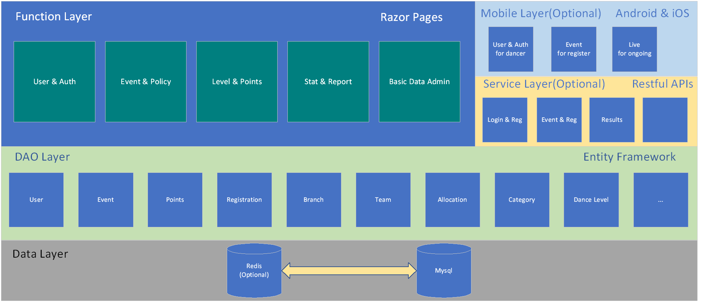

# MyCeroc

## Architecture

## Development

* [ceroc](https://github.com/myceroc/ceroc)
	* [ceroc-site](https://github.com/myceroc/ceroc/tree/master/ceroc-site) : Myceroc website project
	* [ceroc-api](https://github.com/myceroc/ceroc/tree/master/ceroc-api) : Restful APIs project for mobile
* [docs](https://github.com/myceroc/docs)
	* [Development](https://github.com/myceroc/docs/tree/master/Development) : Document collection for development
		* [Naming Convention](https://github.com/myceroc/docs/blob/master/Development/C%23_Naming_Convention.md) 

## Requirement
You can access Product Prototype Document by clicking [Prototype](https://free.modao.cc/app/cc09d5330f81257480da99c67f87ff65319253fc?simulator_type=device&sticky) or scanning QRCode below with your smart phone.

### Weekly

## Changed log
| Number | Content | Author  | Date |
|:----- |:-----|:-----:| :-----:|
| 1   |Architecture, Repository, Documents| Ryan | 29/04/2020 |
|2    |Requirement:Prototype| Ryan|30/04/2020|
|3|Development| Ryan|4/05/2020|
